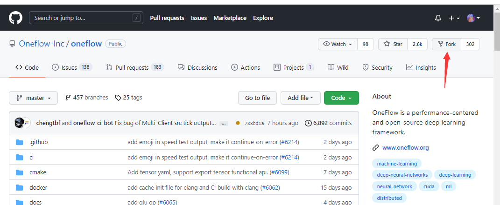
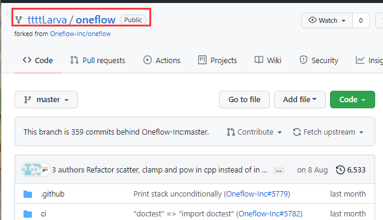
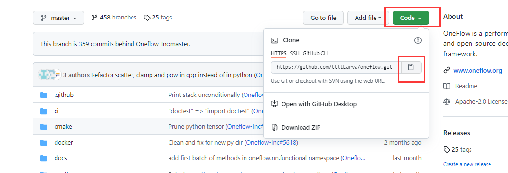
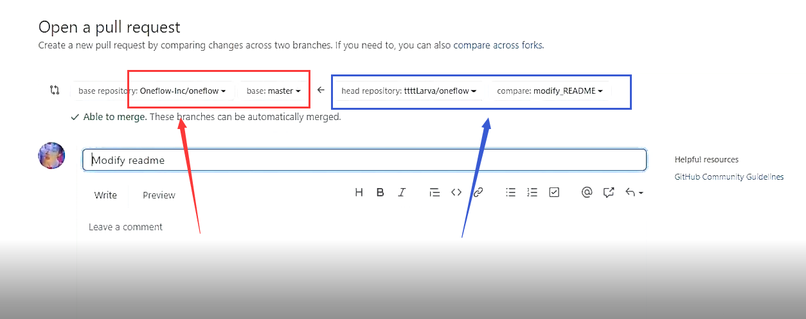
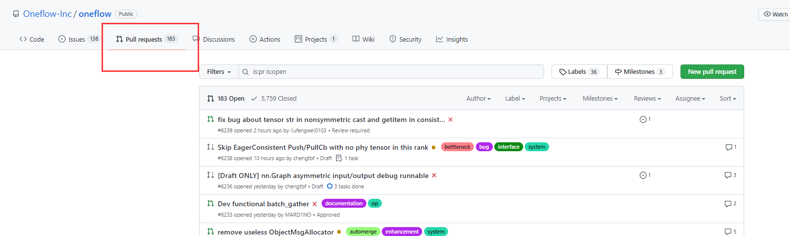

# 如何提交 PR


:earth_asia: **Bilibili视频传送门：**[如何提交 PR](https://www.bilibili.com/video/BV1hq4y1P72f?share_source=copy_web) :earth_asia:


## 什么是 PR
GitHub 上一般通过提交 PR（Pull Request）的方式，像开源项目合并代码。
如何还没有参与过开源项目提交过 PR，可以看看本文小糖以 OneFlow（大佬） 为例，如何提交 PR。
一共有一下几个步骤：

1. fork 仓库
2. 拉取最新代码
3. 创建新分支并在新分支上修改、commit
4. 将分支推送到 GitHub
5. 提交 PR


## 1. fork仓库
参与开源项目的第一步通常是 fork 仓库，它的意义简单而言就是复制一份代码到自己的账号下。

以 [OneFlow-Inc/oneflow](https://github.com/Oneflow-Inc/oneflow/) 为例，点击右上角的 fork 按钮。



之后，就可以看到在自己的账号下，有 oneflow 仓库啦。



## 2. 拉取最新代码
接着，将我们账号下的仓库，克隆一份到本地，方便修改和提交代码。

首先复制仓库名：在自己账号下的 oneflow 仓库页面获取仓库地址



接着克隆到本地，打开控制台：
```
git clone https://github.com/ttttLarva/oneflow.git
```

以上的 `https://github.com/ttttLarva/oneflow.git` 是小糖的账号下的地址，记得替换成你自己对应的仓库哦。


## 3. 创建新分支
在最新代码的基础上，通过 `git checkout -b` 命令，创建新的分支。并在这个新分支上进行修改和 commit 代码。

```
git checkout -b new_branch
```
以上的 `new_branch` 就是新分支名。该命令会创建 `new_branch` 分支并切换到这个新分支上。

修改文件并提交代码

```
git add .
git commit 
```

## 4. 推送到github
提交到本地仓库成功之后，我们就要将改动提交到远程仓库啦，使用命令：

```
git push origin new_branch
```

其实 origin 就是远程仓库地址（`https://github.com/ttttLarva/oneflow.git`）的别名，`new_branch` 是远程仓库分支名，强烈建议与本地分支名保持一致。

## 5. 创建 PR
在第一次 push 到远程仓库成功后，控制台会出现一个链接，我们把这个链接复制到浏览器打开，就可以跳转到创建PR的界面：


以上左边红色：代表我们要想要把这个改动合并到 OneFlow 的哪一个分支
以上右边蓝色：代表我们前面改动的分支
接着就是一些信息填写啦，写好标题和对这笔改动的描述，点击 Create 按钮，PR 就创建成功了。

最后我们就可以在 OneFlow 的仓库下看到我们提交的PR啦



## 扩展阅读

- [GitHub 官网：Collaborate with pull requests](https://docs.github.com/en/github/collaborating-with-pull-requests)
- [Git 基本操作官方文档](https://git-scm.com/doc)
