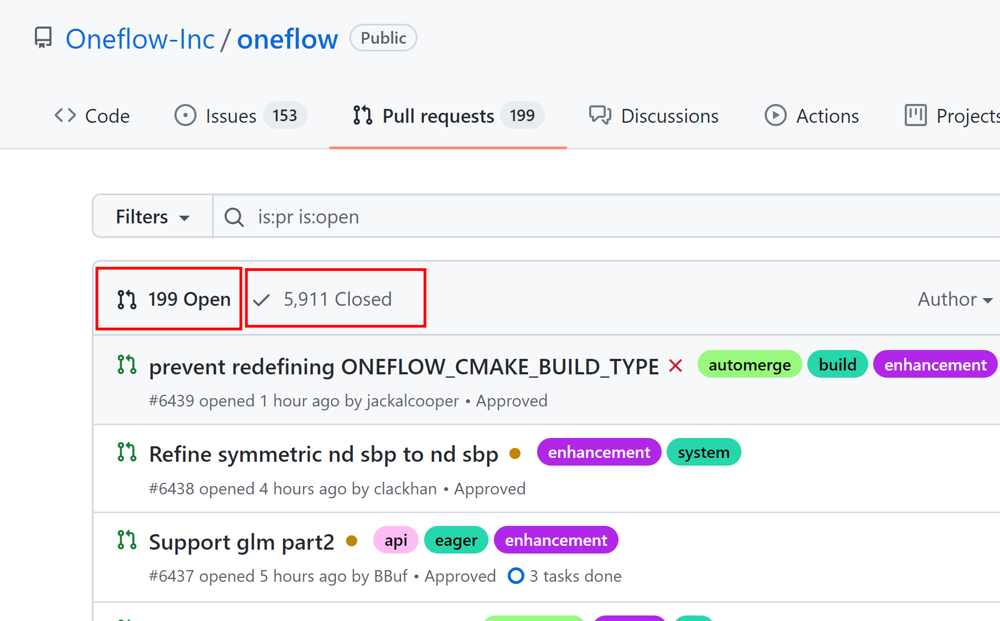
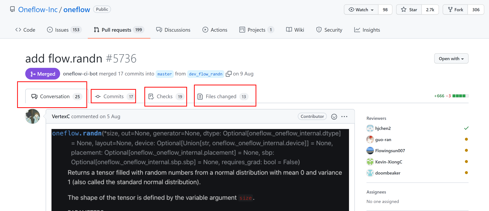
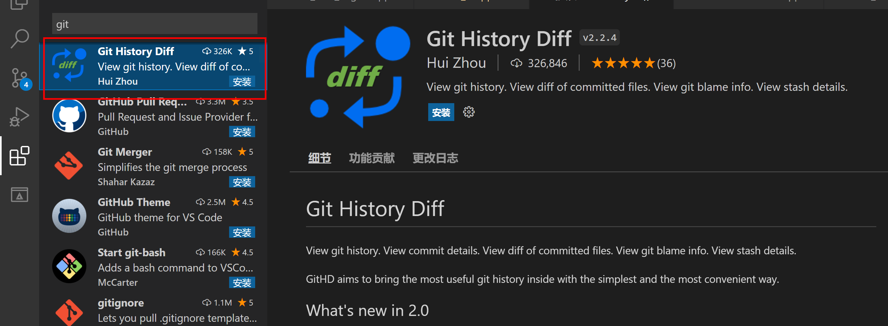

# 如何通过 PR 学习 & VS Code好用插件分享

:earth_asia: **Bilibili视频传送门：**[通过PR学习&VS Code插件分享](https://www.bilibili.com/video/BV19f4y1j78T?share_source=copy_web) :earth_asia:

## 如何通过 PR 学习

今天给大家分享的是如何在github上通过搜索PR(pull requests)进行自我能力的拓展。
首先就要学会读PR，接下来我将以深度学习框架`OneFlow`的PR为例子，来说明PR的各个字段，并怎么通过PR学习。

PR分为两类：

* Open：正在合并，还在评审的PR
* Clode：已经合并，或者放弃合并的PR

PR标题边的彩色标签，是对这个PR的简单分类。

github还自带了多种搜索功能，比如可以筛选某个感兴趣的作者提交的PR

**那么具体如何通过PR进行学习呢？**

进入PR详情界面

* Conversation：这一栏的主贴，一般会描述这个PR改动的原因、功能然后reviewer会评审该PR。reviewer合PR作者会在这里展开对话讨论
* Files Changed：包含了该PR的改动项，红色是PR作者删除的内容，绿色是新增的内容

## 超好用的vs插件分享

如果要每次都点开github仓库，再对PR进行学习，可能不是很便捷；因此推荐一个vscode插件，可以在本地仓库就让我们查看到PR。

强烈推荐：**Git History Diff** 插件

具体有多好用呢？去看看视频后，大家快快动手下载下来试试吧~
