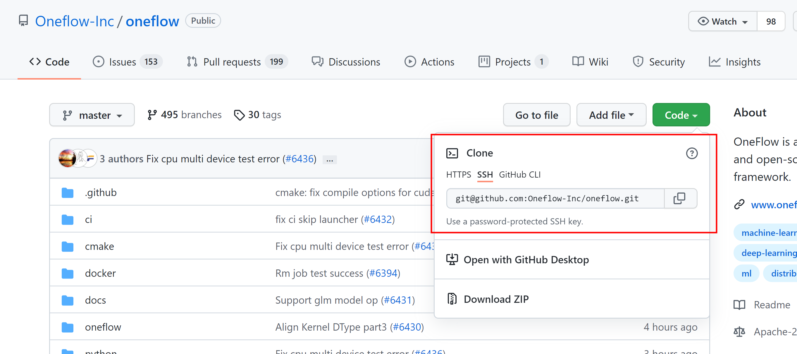
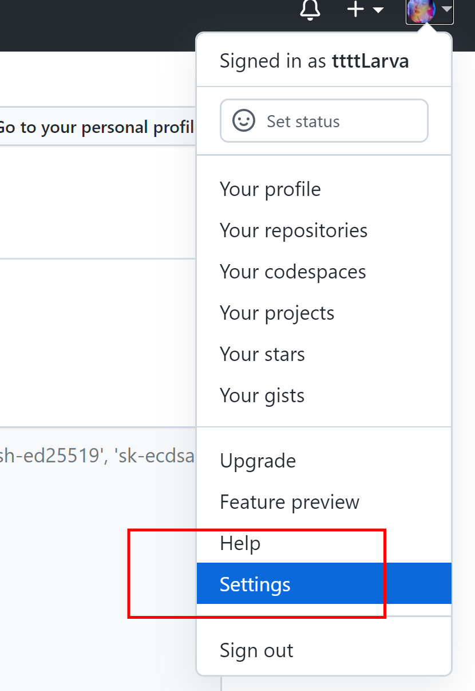
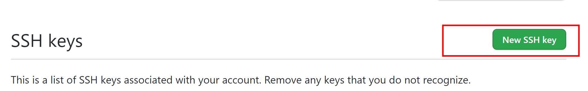

# github SSH免密码登录


:earth_asia: **Bilibili视频传送门：**[github SSH免密码登录](https://www.bilibili.com/video/BV1NL411x7z9?share_source=copy_web) :earth_asia:


## 什么是SSH



如上图，在github仓库的Code栏，可以查看到SSH标签。

SSH是一种常见的登录协议，使用SSH的好处是不用在下载或者上传代码时，每次都输入账号密码。

## 配置SSH连接github

具体可参考https://docs.github.com/cn/github/authenticating-to-github/connecting-to-github-with-ssh

具体步骤如下：

* 本地生成密钥对

* 将公钥添加到github

* 测试使用

### 本地生成密钥对

win+R打开控制台，使用命令：

```
ssh-keygen -t rsa -b 4096 -C "最好为github的账号"
```

后面一路直接回车

接着就在（用户/.ssh）目录下生成了两个文件

* id_rsa是私钥文件
* id_rsa.pub是公钥文件

### 将公钥添加到github

打开github，点击个人页面的头像，点击`Settings`



点击 `SSH and GPG keys`


点击`New SSH Key`




打开第二步在本地生成的`id_rsa.pub`文件，将里面的所有内容复制到如下对话框。


最终点击`Add SSH Key`按钮 就能成功添加啦

### 测试使用

接着使用命令：

```
ssh -T git@github.com
```

检验是否配置成功

> 注意：第一次连接，会有提示是否信任github服务器，我们需要输入yes

