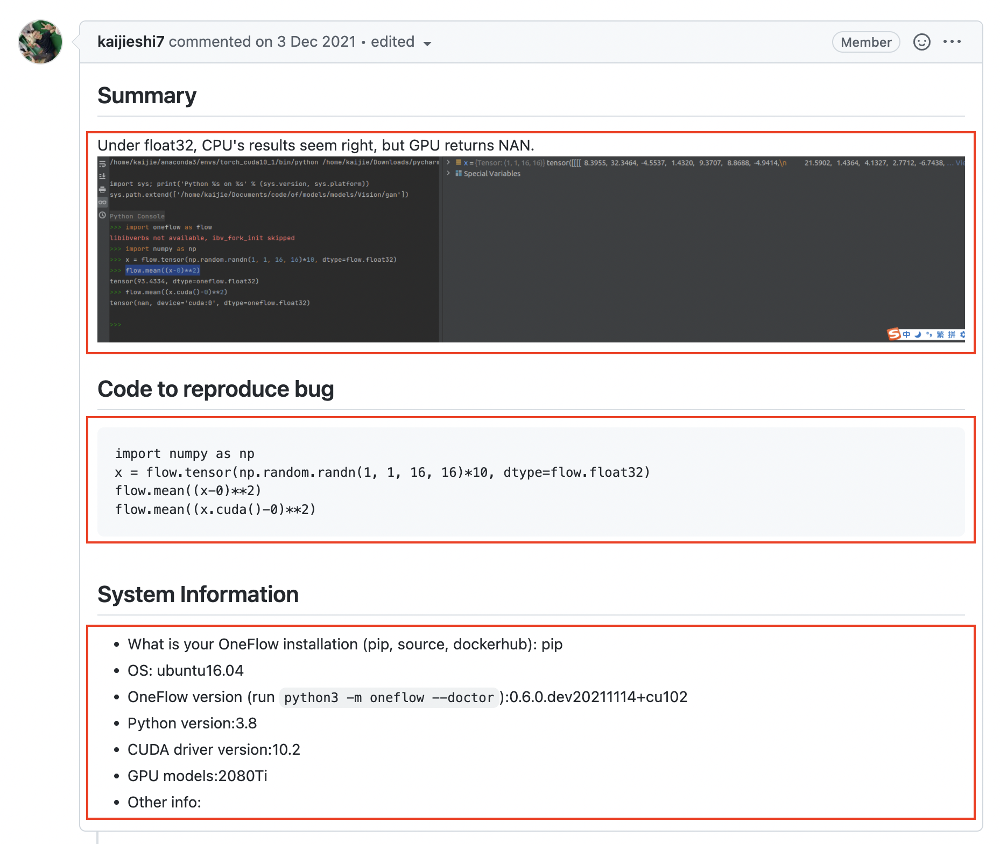
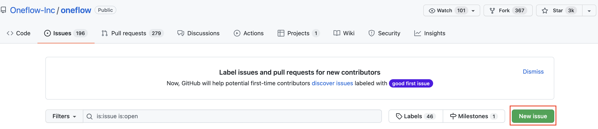
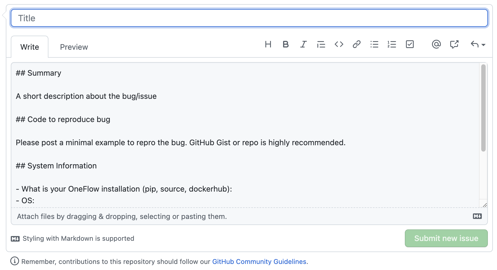
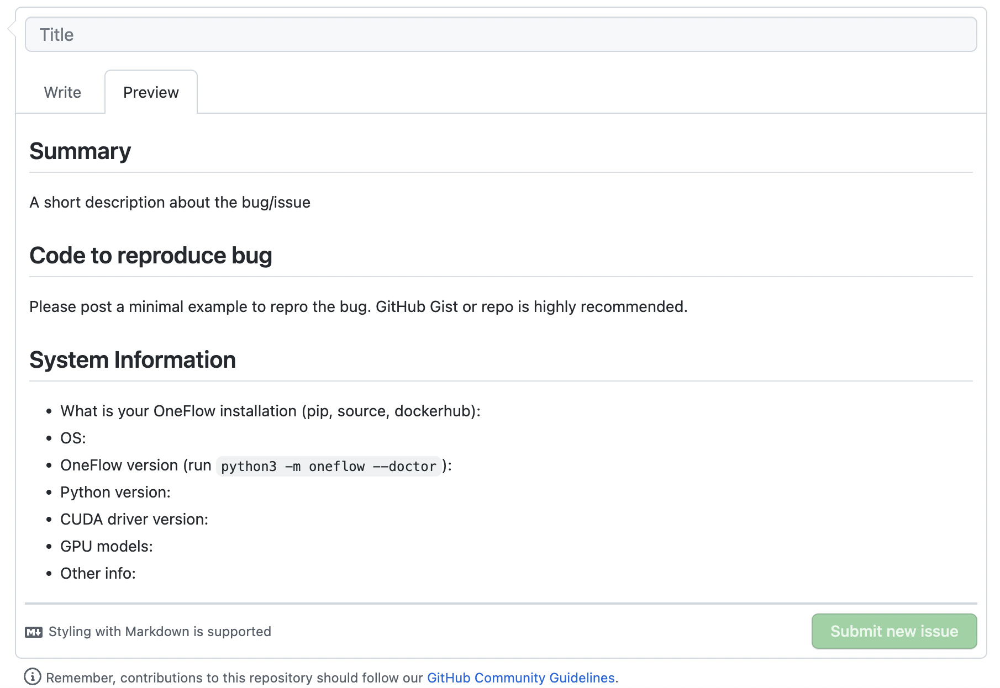

#  快速上手 Markdown


:earth_asia: **Bilibili 视频传送门：**[快速上手 Markdown](https://www.bilibili.com/video/BV1P44y1a7oB?spm_id_from=333.999.0.0) :earth_asia:

## 什么是 Markdown 


Markdown 是一种标记性语言，在 GitHub 上提交 issue、PR，默认都使用的是 Markdown。

Markdown 简单易学，展现内容的手段丰富多样，可以参与开源，也可以用来记录自己的笔记。

## 在 GitHub 上写 Markdown


接下来我将以深度学习框架 [OneFlow](https://github.com/Oneflow-Inc/oneflow) 的 [issue](https://github.com/Oneflow-Inc/oneflow/issues) 为例子， 展现一下 Markdown 的功能。

我们可以看到在下面这个 [issue](https://github.com/Oneflow-Inc/oneflow/issues/6917) 中，既有图片也有代码区，还有列表，这些是如何用 Markdown 实现的呢？



我们在 [OneFlow](https://github.com/Oneflow-Inc/oneflow) 中创建一个新的 issue，点击 [New issue](https://github.com/Oneflow-Inc/oneflow/issues/new/choose) 按钮。



在 Write 和 Preview 部分就是 Markdown 书写区和预览区的一个对比。



- `## ` 加空格后面所对应的内容就是标题

- 连接符 `- ` 加空格后面的内容是列表所对应的一个 item

## 学习 Markdown 语法


我们接下来看看常见的 Markdown 语法有哪些，系统学习下。

### 1. 标题

在想要设置为标题的文字前面加 `# ` 来表示
一个 `# ` 是一级标题，两个 `# ` 是二级标题，以此类推。支持六级标题。

```
# 这是一级标题
## 这是二级标题
### 这是三级标题
#### 这是四级标题
##### 这是五级标题
###### 这是六级标题
```

### 2. 图片

语法：

```

```

图片 alt 就是显示在图片下面的文字，相当于对图片内容的解释。
图片 title 是图片的标题，当鼠标移到图片上时显示的内容。title 可加可不加。

示例：

```

```

效果：


### 3. 超链接

语法：

```
[超链接名](超链接地址 "超链接title")
```

title 可加可不加

示例：

```
[OneFlow](https://github.com/Oneflow-Inc/oneflow)
```

效果：

[OneFlow](https://github.com/Oneflow-Inc/oneflow)

### 4. 代码

单行代码：代码之间分别用一个反引号包起来

```
`代码内容`
```

代码块：代码之间分别用三个反引号包起来，且两边的反引号单独占一行，在第一行引号后面加入代码种类可以获得代码高亮。

````python
```Python
class Solution:
    def twoSum(self, nums: List[int], target: int) -> List[int]:
        hashtable = dict()
        for i in range(len(nums)):
            if target - nums[i] in hashtable:
                return [i, hashtable[target - nums[i]]]
            hashtable[nums[i]] = i
```
````

### 5. 引用

`>` 表示引用，表示当前语句不是自己的，在开源项目中常常用于回复别人的话。

示例：

```
> C++ 很好用
```

效果：

> C++ 很好用

除了上述语法外，Markdown 还有很多用法，大家可以在扩展阅读中学习。


## VS Code 插件分享


这里分享一个非常实用的插件，在使用 Markdown 时，[**Auto-Open Markdown Preview**](https://marketplace.visualstudio.com/items?itemName=hnw.vscode-auto-open-markdown-preview) 插件可以帮我们实时渲染 Markdown 页面。


## 扩展阅读


- [GitHub 官方 Markdown 教程](https://docs.github.com/en/get-started/writing-on-github/getting-started-with-writing-and-formatting-on-github/basic-writing-and-formatting-syntax)
