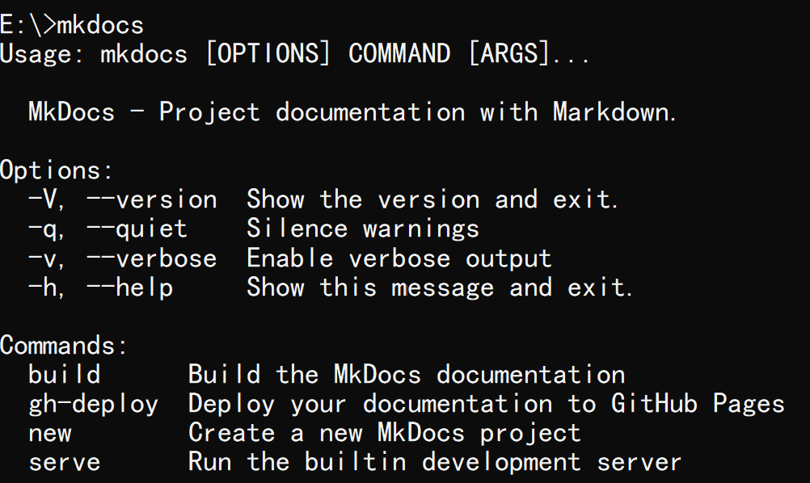
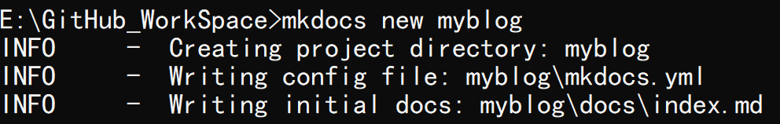
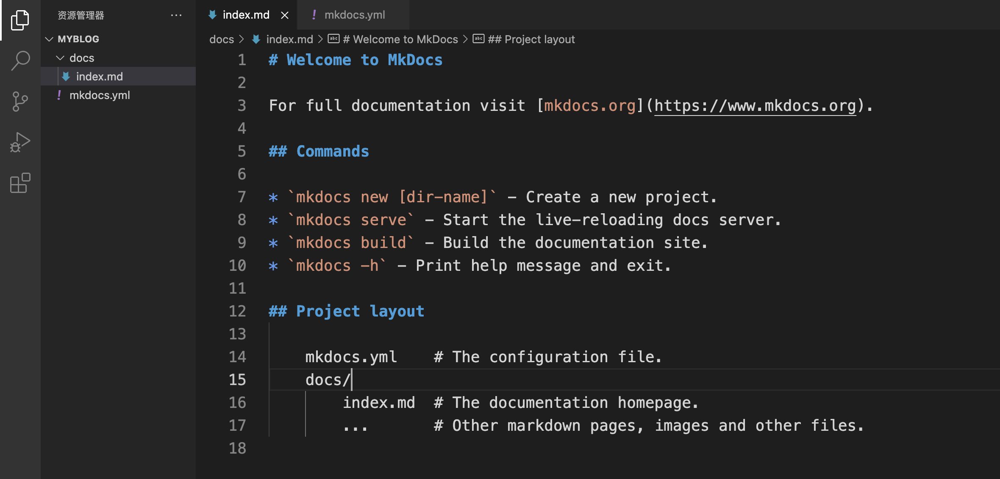
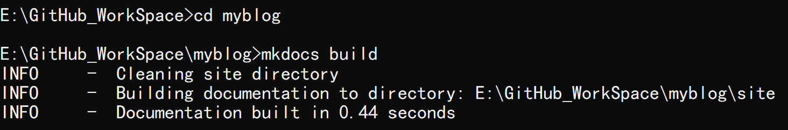
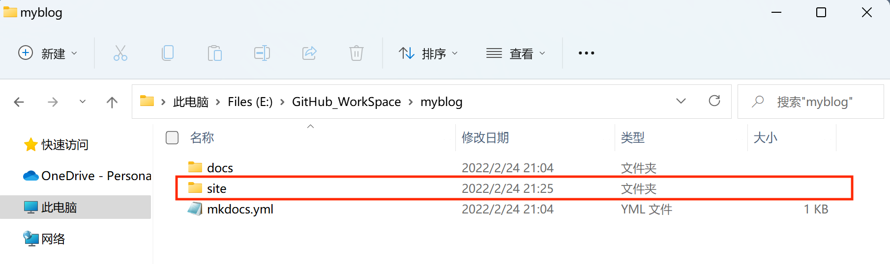
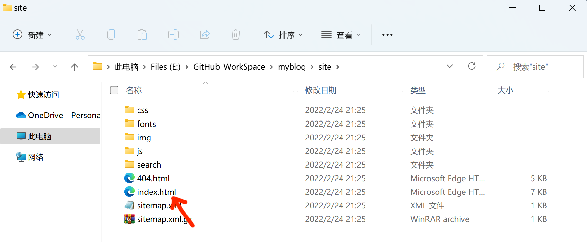
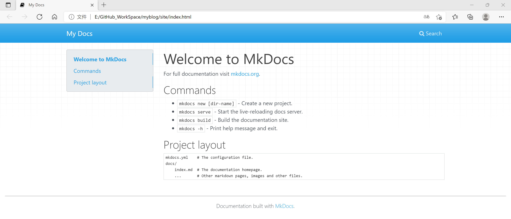
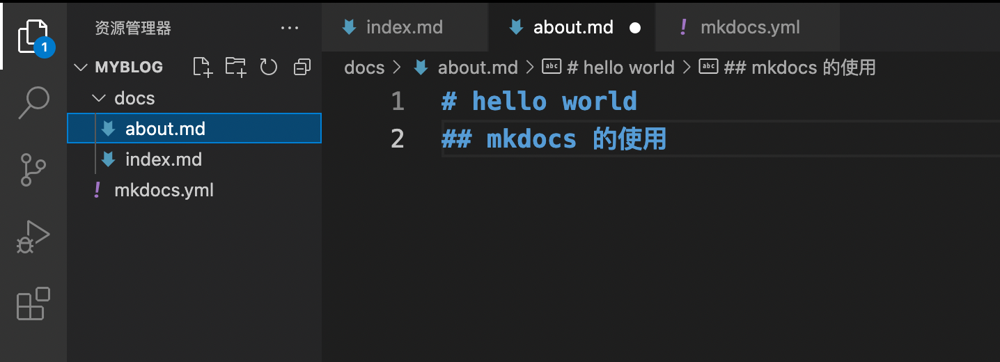
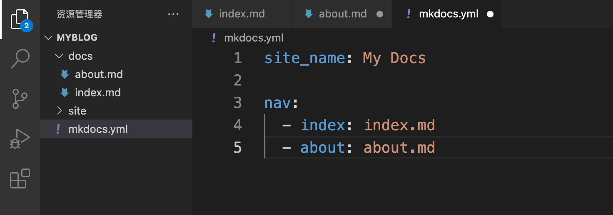
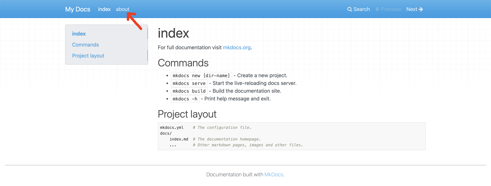

# [MkDocs](https://www.mkdocs.org/) 工具使用


:earth_asia: **Bilibili视频传送门：**[MkDocs 工具使用](https://www.bilibili.com/video/BV1rq4y1y7zi?p=1) :earth_asia:


很多程序员朋友都有写技术博客的习惯，包括你们现在看到的这个网站，也是我将视频的内容都做成了[个人网站](https://www.ttlarva.com/)。这个网站其实就对应了一个 GitHub 仓库，每次提交修改到这个仓库的时候，我的网站也会被自动更新。

那这些是如何实现的呢？主要需要以下三个步骤：

- 使用 [MkDocs](https://www.mkdocs.org/) 工具生成网站
- 使用 [GitHub Pages](https://pages.github.com/) 展示自己的网站
- 使用 [GitHub Actions](https://docs.github.com/cn/actions) 帮助我们实现工作流自动化

下面我们就具体介绍一下如何使用它们打造属于自己的免费网站。我们首先来介绍一下 MkDocs。


## MkDocs 介绍与安装

MkDocs 是一个文本工具，我们可以使用 Markdown 写文章，接着再使用 MkDocs 命令，将其转变为 HTML 文件。MkDocs 是一个 Python 包，我们可以使用 [pip](https://pypi.org/project/pip/) 来进行安装，安装命令如下：

```
python -m pip install mkdocs
```

安装完 MkDocs 后，我们就可以运行 `mkdocs` 命令：

```
mkdocs
```

可以看到相应的提示信息：




## 使用 MkDocs 创建工程

 接着，我们用 `mkdocs new` 命令来创建一个名叫 myblog 的工程:

```
mkdocs new myblog
```



这个 myblog 就是我们要放到 GitHub 上的仓库目录，我们用 VS Code 打开这个目录来看看它的结构：



我们可以发现，myblog 目录下只有两样东西，一个是 docs 目录和一个 yaml 文件，docs 目录下存放的就是 Markdown 文件，这里也就是我们网站的内容，yaml 文件是我们工程的配置文件。


## 使用 Mkdocs 生成网页

接下俩，我们使用 `mkdocs build` 命令，就可以根据 yaml 文件的设置，将 Markdown 文件编译成网页 HTML 文件。 命令和运行结果如下：

```
mkdocs build
```



可以看到，命令完成之后，我们就得到了一个 site 文件夹。



打开 site 文件，里面就是生成好的整个网站了，我们点击 index.html，就可以看到网站的效果了。






## MkDocs 的配置

通过改变  yaml 文件，我们可以改变网站的输出效果。那么 yaml 文件是如何起作用的呢？我们通过一个例子来了解一下。

比如我们在  docs 目录下新增加一个 about.md 的文件，内容如下图所示：



并且在  yaml 文件中做相应的修改：



我们来重新编译一下看看会有什么样的结果：



我们可以发现在网页中果然多了 about 这一栏。:astonished:

我们接下来简单介绍一些常用的 MkDocs 配置。

### 1. 增加页面

如果我们想要在 mkdocs.yml 文件中配置添加页面，我们可以在并通过添加 [nav](https://mkdocs.zimoapps.com/user-guide/configuration/#nav) 设置来实现：

```yaml
site_name: myproject
nav:
    - Home: index.md
    - About: about.md
```


### 2. 修改配置文件增加多级文档

我们也可以设置目录，增加多级文档：

```yaml
site_name: myproject
nav:
    - Home: index.md
    - Install: install.md
    - Documents:
        - Usage: usage.md
        - Tutorial: tutorial.md
```


### 3. 主题化我们的文档

现在，更改配置文件以通过更改主题来更改文档的显示方式。 编辑 mkdocs.yml 文件并添加 [theme](https://mkdocs.zimoapps.com/user-guide/configuration/#theme) 设置：

```yaml
site_name: myproject
nav:
    - Home: index.md
    - About: about.md
theme: readthedocs
```

保存更改，你将看到改为使用了ReadTheDocs主题。


## 扩展资料

通过以上介绍，相信你已经对 MkDocs 有了基本的了解，如果大家想要更详细了解 MkDocs，可以阅读 [MkDocs 中文文档](https://mkdocs.zimoapps.com/#mkdocs)。

