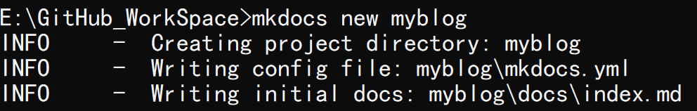
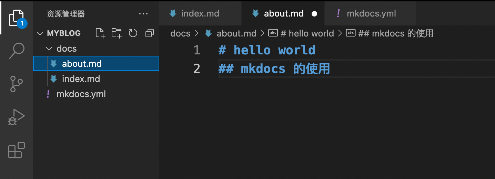

# GitHub 打造免费网站


:earth_asia: **Bilibili视频传送门：**[GitHub 打造免费网站](https://www.bilibili.com/video/BV1rq4y1y7zi?spm_id_from=333.999.0.) :earth_asia:


很多程序员朋友都有写技术博客的习惯，包括你们现在看到的这个网站，也是小糖将视频的内容都做成了[个人网站](https://www.ttlarva.com/)。这个网站其实就对应了一个 GitHub 仓库，小糖每次提交修改到这个仓库的时候，我的网站也会被自动更新。

那这些是如何实现的呢？主要需要以下三个步骤：

- 使用 [MkDocs](https://www.mkdocs.org/) 工具生成网站
- 使用 [GitHub Pages](https://pages.github.com/) 展示自己的网站
- 使用 [GitHub Action](https://docs.github.com/cn/actions) 帮助我们实现工作流自动化

下面我们就具体介绍一下如何使用它们打造属于自己的免费网站。


## [MkDocs](https://www.mkdocs.org/) 工具使用


MkDocs 是一个文本工具，我们可以使用 Markdown 写文章，接着再使用 MkDocs 命令，将其转变为 HTML 文件。MkDocs 是一个 Python 包，我们可以使用 [pip](https://pypi.org/project/pip/) 来进行安装，安装命令如下：

```
python -m pip install mkdocs
```

安装完 MkDocs 后，我们就可以运行 `mkdocs` 命令：

```
mkdocs
```

可以看到相应的提示信息：


 接着，我们用 `mkdocs new` 命令来创建一个名叫 myblog 的工程:

```
mkdocs new myblog
```



这个 myblog 就是我们要放到 GitHub 上的仓库目录，我们用 VS Code 打开这个目录来看看它的结构：


我们可以发现，myblog 目录下只有两样东西，一个是 docs 目录和一个 yaml 文件，docs 目录下存放的就是 Markdown 文件，这里也就是我们网站的内容，yaml 文件是我们工程的配置文件。

接下俩，我们使用 `mkdocs build` 命令，就可以根据 yaml 文件的设置，将 Markdown 文件编译成网页 HTML 文件。 命令和运行结果如下：

```
mkdocs build
```


可以看到，命令完成之后，我们就得到了一个 site 文件夹。


打开 site 文件，里面就是生成好的整个网站了，我们点击 index.html，就可以看到网站的效果了。


通过改变  yaml 文件，我们可以改变网站的输出效果。那么  yaml 文件是如何起作用的呢？我们通过一个例子来了解一下。

比如我们在  docs 目录下新增加一个 about.md 的文件，内容如下图所示：



并且在  yaml 文件中做相应的修改：


我们来重新编译一下看看会有什么样的结果：


我们可以发现在网页中果然多了 about 这一栏。:astonished:

有了整个网站的 HTML 文件，我们把它上传到云服务器上，那就可以当作自己的博客了。但是这样做费时费力，有没有简单方便，最好还是免费的方法呢？那就要隆重介绍一下 [GitHub Pages](https://pages.github.com/) 的生成和使用了。


## [GitHub Pages](https://pages.github.com/) 的生成和使用

