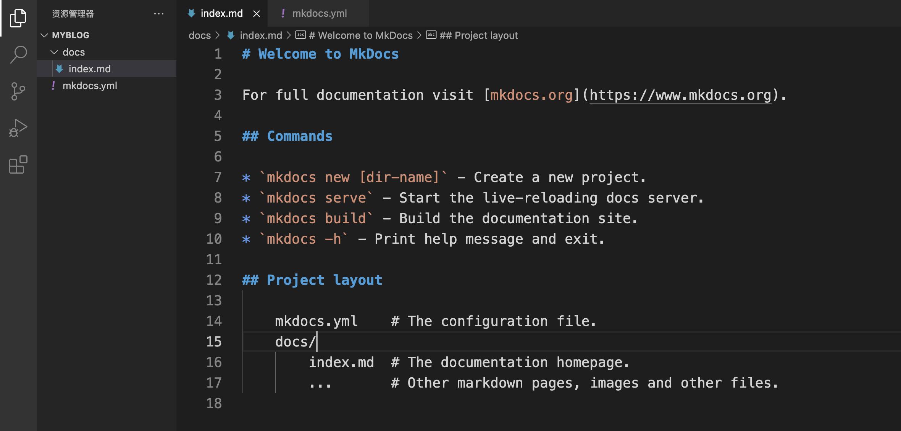
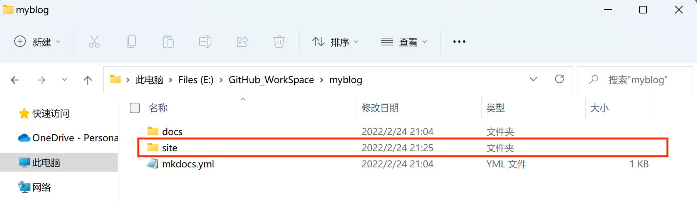
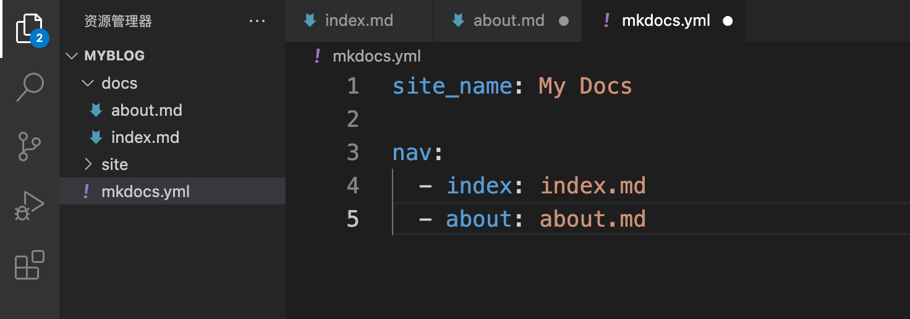
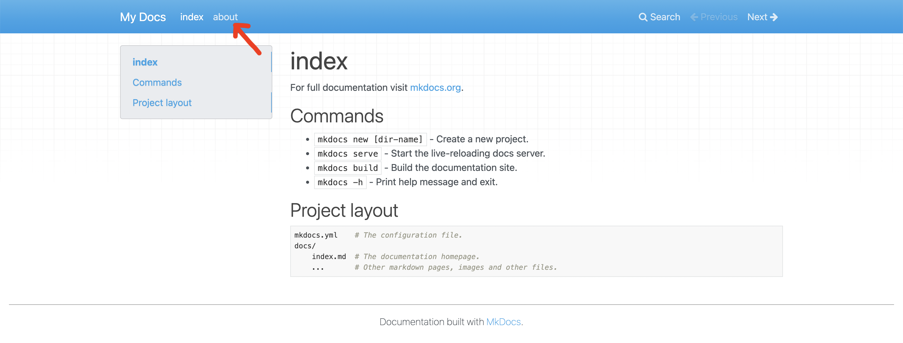

# GitHub 打造免费网站


:earth_asia: **Bilibili视频传送门：**[GitHub 打造免费网站](https://www.bilibili.com/video/BV1rq4y1y7zi?spm_id_from=333.999.0.) :earth_asia:


很多程序员朋友都有写技术博客的习惯，包括你们现在看到的这个网站，也是我将视频的内容都做成了[个人网站](https://www.ttlarva.com/)。这个网站其实就对应了一个 GitHub 仓库，每次提交修改到这个仓库的时候，我的网站也会被自动更新。

那这些是如何实现的呢？主要需要以下三个步骤：

- 使用 [MkDocs](https://www.mkdocs.org/) 工具生成网站
- 使用 [GitHub Pages](https://pages.github.com/) 展示自己的网站
- 使用 [GitHub Action](https://docs.github.com/cn/actions) 帮助我们实现工作流自动化

下面我们就具体介绍一下如何使用它们打造属于自己的免费网站。


## [MkDocs](https://www.mkdocs.org/) 工具使用


### MkDocs 介绍与安装

MkDocs 是一个文本工具，我们可以使用 Markdown 写文章，接着再使用 MkDocs 命令，将其转变为 HTML 文件。MkDocs 是一个 Python 包，我们可以使用 [pip](https://pypi.org/project/pip/) 来进行安装，安装命令如下：

```
python -m pip install mkdocs
```

安装完 MkDocs 后，我们就可以运行 `mkdocs` 命令：

```
mkdocs
```

可以看到相应的提示信息：


### 使用 MkDocs 创建工程

 接着，我们用 `mkdocs new` 命令来创建一个名叫 myblog 的工程:

```
mkdocs new myblog
```


这个 myblog 就是我们要放到 GitHub 上的仓库目录，我们用 VS Code 打开这个目录来看看它的结构：



我们可以发现，myblog 目录下只有两样东西，一个是 docs 目录和一个 yaml 文件，docs 目录下存放的就是 Markdown 文件，这里也就是我们网站的内容，yaml 文件是我们工程的配置文件。


### 使用 Mkdocs 生成网页

接下俩，我们使用 `mkdocs build` 命令，就可以根据 yaml 文件的设置，将 Markdown 文件编译成网页 HTML 文件。 命令和运行结果如下：

```
mkdocs build
```


可以看到，命令完成之后，我们就得到了一个 site 文件夹。



打开 site 文件，里面就是生成好的整个网站了，我们点击 index.html，就可以看到网站的效果了。


通过改变  yaml 文件，我们可以改变网站的输出效果。那么  yaml 文件是如何起作用的呢？我们通过一个例子来了解一下。

比如我们在  docs 目录下新增加一个 about.md 的文件，内容如下图所示：


并且在  yaml 文件中做相应的修改：



我们来重新编译一下看看会有什么样的结果：



我们可以发现在网页中果然多了 about 这一栏。:astonished:

有了整个网站的 HTML 文件，我们把它上传到云服务器上，那就可以当作自己的博客了。但是这样做费时费力，有没有简单方便，最好还是免费的方法呢？那就要隆重介绍一下 GitHub Pages 的生成和使用了。


## [GitHub Pages](https://pages.github.com/) 的生成和使用


### 什么是 GitHub Pages ？

在前面我们知道可以使用 MkDocs 工具来使 Markdown 变成静态的 HTML 文件，如果租一个服务器，把这些静态 HTML 文件传上去，那我们搭博客的任务是不是就完成了呢？但是这完全没有必要，免费的 GitHub Pages 就可以完成这些功能了。

GitHub Pages 是 GitHub 所提供的一项功能，它的作用就是使 GitHub 中的每一个仓库都有与之对应的网站。它的实现方式也非常简单，只需要简单的两步：

- 把网页文件上传到远程仓库的 gh-pages 分支上
- 在仓库的 setting 里选择 gh-pages 分支作为网站分支

最后通过这个 URL：`<账号>github.io/<仓库名>` 就可以访问了。这些听起来可能有一些抽象，我们一起操作一遍大家可以明白啦。


### 在 GitHub Pages 中发布 myblog

首先，我们需要创建一个远程的 GitHub 仓库，并将并且将刚刚的 myblog 推送到了这个仓库：

```
git push -u origin main
```


接下来，我们创建一个 gh-pages 分支，并且切换到这个分支上：

```
git checkout -b gh-pages
```


然后使用 `mkdocs build` 命令编译得到 HTML 文件：

```
mkdocs build
```


然后我们删掉 site 这个静态网站之外的其它文件，并将 site 文件中的目录都移动到根目录，最后删除 site 文件夹：

```
rm -rf docs/ mkdocs.yml
cp -R site/* ./
rm -rf site/
```

我们将刚刚的改动进行 commit  和 push：

```
git commit -a -m "gh-pages start"
git push origin gh-pages
```


接下来，我们找到远程仓库的 Settings 一栏，再找到 Pages 这一栏，就会发现有个漂亮的绿色在提示我们，我们的网站已经被发布到这个链接中了。


我们点开这个[链接](https://wangchenhao00.com/MyBlog/)，就可以发现我们的博客已经成功上线了。

看到这里，相信大家已经完全有能力来自己搭建一个网站了，如果不嫌麻烦的话，我们完全可以按照以下步骤来搭建网站：

- 先用 Markdown 写内容
- 再用 `mkdocs build` 编译得到 HTML 文件
- 把 HTML 文件上传到 GitHub Pages 所在分支上

但是这样的流程还是太繁琐了，我们在 GitHub 的操作上花费了太多精力。要是我们可以只管写博客，其他的工作可以自动化完成就好了。那如何做到自动化呢？请看我们接下来的介绍。