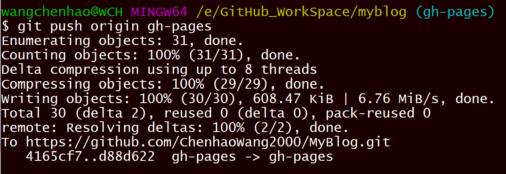
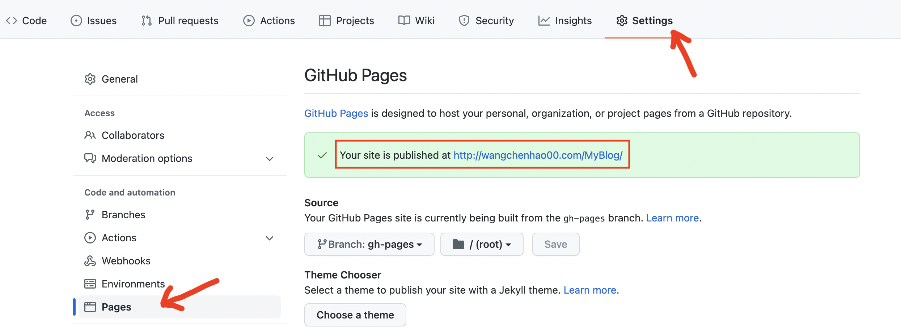

# [GitHub Pages](https://pages.github.com/) 的生成和使用


:earth_asia: **Bilibili视频传送门：**[GitHub Pages 的生成和使用](https://www.bilibili.com/video/BV1rq4y1y7zi?p=2) :earth_asia:


看了前面 MkDocs 的介绍，我们可以使用 MkDocs 工具生成整个网站的 HTML 文件，我们把它上传到云服务器上，那就可以当作自己的博客了。但是这样做费时费力，有没有简单方便，最好还是免费的方法呢？答案是有的，这里我们就给大家介绍一下 [GitHub Pages](https://pages.github.com/) 的生成和使用。


## 什么是 GitHub Pages ？

GitHub Pages 是 GitHub 所提供的一项功能，它的作用就是使 GitHub 中的每一个仓库都有与之对应的网站。它的实现方式也非常简单，只需要简单的两步：

- 把网页文件上传到远程仓库的 gh-pages 分支上
- 在仓库的 Settings 里选择 gh-pages 分支作为网站分支

最后通过这个 URL：`<账号>github.io/<仓库名>` 就可以访问了。这些听起来可能有一些抽象，我们一起操作一遍大家可以明白啦。


## 在 GitHub Pages 中发布 myblog

首先，我们需要创建一个远程的 GitHub 仓库，并将并且将刚刚的 myblog 推送到了这个仓库：

```
git push -u origin main
```


接下来，我们创建一个 gh-pages 分支，并且切换到这个分支上：

```
git checkout -b gh-pages
```


然后使用 `mkdocs build` 命令编译得到 HTML 文件：

```
mkdocs build
```


然后我们删掉 site 这个静态网站之外的其它文件，并将 site 文件中的目录都移动到根目录，最后删除 site 文件夹：

```
rm -rf docs/ mkdocs.yml
cp -R site/* ./
rm -rf site/
```

我们将刚刚的改动进行 commit  和 push：

```
git commit -a -m "gh-pages start"
git push origin gh-pages
```



接下来，我们找到远程仓库的 Settings 一栏，再找到 Pages 这一栏，就会发现有个漂亮的绿色在提示我们，我们的网站已经被发布到这个链接中了。



我们点开这个 `<账号>github.io/<仓库名>` 的链接，就可以发现我们的博客已经成功上线了。

看到这里，相信大家已经完全有能力来自己搭建一个网站了，如果不嫌麻烦的话，我们完全可以按照以下步骤来搭建网站：

- 先用 Markdown 写内容
- 再用 `mkdocs build` 编译得到 HTML 文件
- 把 HTML 文件上传到 GitHub Pages 所在分支上

但是这样的流程还是太繁琐了，我们在 GitHub 的操作上花费了太多精力。要是我们可以只管写博客，其他的工作可以自动化完成就好了。那如何做到自动化呢？请看我们下一篇的介绍。
