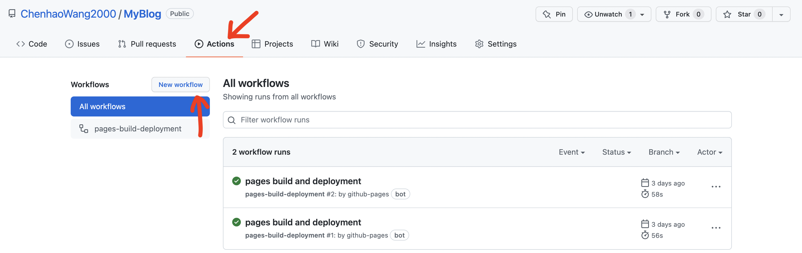
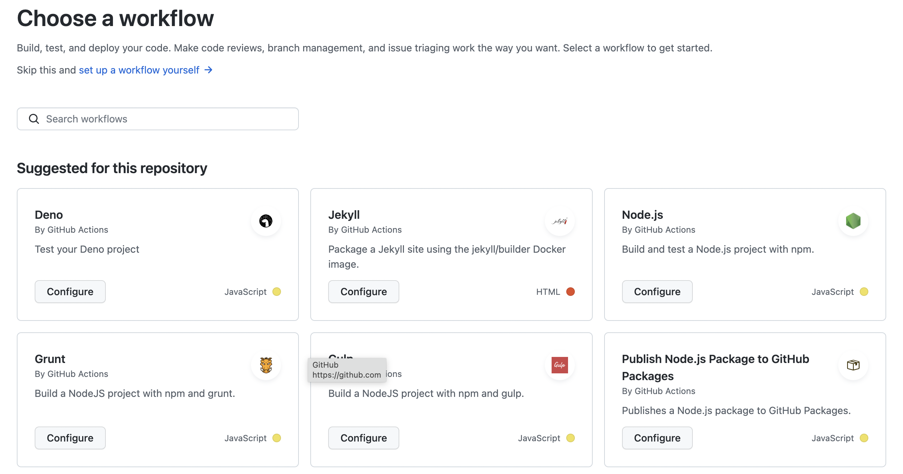
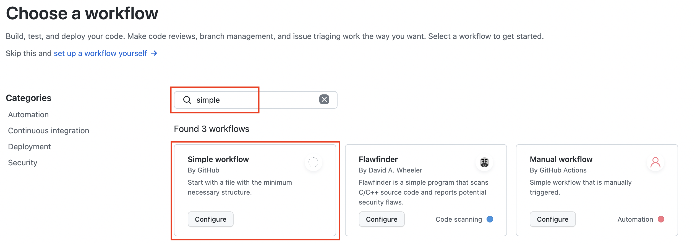
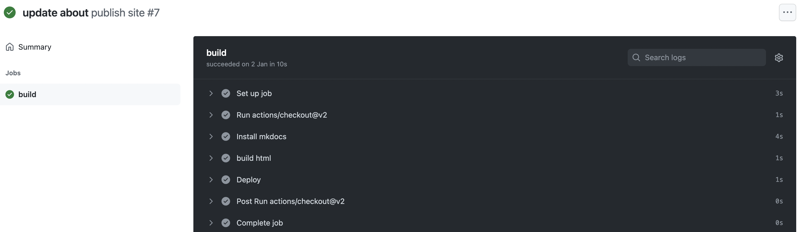
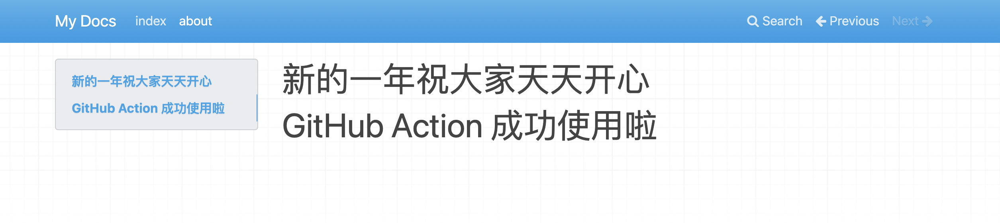

# [GitHub Actions](https://docs.github.com/cn/actions) 介绍 & 使用


:earth_asia: **Bilibili视频传送门：**[GitHub Actions 介绍 & 使用](https://www.bilibili.com/video/BV1rq4y1y7zi?p=3) :earth_asia:


前面我们提到，只用 MkDocs 和 GitHub Pages 搭建网站还是太繁琐了，而使用 [GitHub Actions](https://docs.github.com/cn/actions) 就可以做到工作流的自动化。下面我们就具体来介绍一下 [GitHub Actions](https://docs.github.com/cn/actions) 吧。


## 什么是 GitHub Actions

GitHub Actions 是 GitHub 的一项功能，它可以帮助我们把开发的工作流给自动化。那么什么又是工作流呢？我们以开源项目 [OneFlow](https://github.com/Oneflow-Inc/oneflow) 来举个例子：

在用户使用的过程中发现了新的需求，于是去提了 [issue](https://github.com/Oneflow-Inc/oneflow/issues) 找人提问。相关人员就会在这个 issue 中对线，于是去开了 [PR](https://github.com/Oneflow-Inc/oneflow/pulls) 提交了新功能。在新的 PR 的开发过程中，可能需要多次的 review 修正。PR 新功能开发完毕之后，还需要各种的测试流程，通过测试后才可以面向用户上线。以上这些环节组合在一起，就是一个工作流的例子。

而 GitHub Actions 可以将工作流自动化，想象以下场景：如果我们创建了 issue，就会自动提醒最合适的人员参与对线。创建了新的 PR，就能自动找到最合适的人参与 review，代码完成以后可以自动进行测试，测试完成之后又能够自动合并到主分支，主分支有代码合并后，就会自动编译和部署新版本的产品。这样是不是就让我们开发的幸福感更高了。


## GitHub Events & Actions

GitHub 使用了 Action 和 Event 这两个概念，来方便用户去配置自动化工作流。当某些 Event 发生时，就去触发相应的预设好的 Action。

像我们之前提到的：创建 issue、创建PR、代码提交等都是 Event，而把任务分配给合适的人和开始测试等都是 Action，都是可以去提前配置好的。

那我们怎么在 GitHub 仓库中去配置 Event 和 Action 的对应关系呢？答案就是在特定的目录下创建专门的 yaml 文件。在 GitHub 中，我们只需要将配置好的 yaml 文件放到 GitHub 目录下的 workflows 目录下就可以了。这样 GitHub 就可以自动去监听 yaml 文件中指定的 Event，并且当这些 Event 发生时，就触发了相应的 Action。


下面我们直接在 GitHub 上操作一下给大家看看吧。


### Simple Workflow

下面我们将从无到有，创建一个 GitHub Action。

我们继续使用刚刚的 myblog 仓库，然后点击 [Actions](https://github.com/ChenhaoWang2000/MyBlog/actions) 这一栏，点开 New workflow。



我们发现有很多现成的 workflow 供我们参考和使用，它们都包含了部署和常见的测试流程：



我们选择最简单的 simple workflow。



打开之后发现一个 yaml 文件，这个 yaml 文件就描述了一个工作流，yaml 文件的内容如下。

```yaml
# This is a basic workflow to help you get started with Actions

name: publish site

# Controls when the workflow will run
on:
  # Triggers the workflow on push or pull request events but only for the main branch
  push:
    branches: [ main ]
  pull_request:
    branches: [ main ]

  # Allows you to run this workflow manually from the Actions tab
  workflow_dispatch:

# A workflow run is made up of one or more jobs that can run sequentially or in parallel
jobs:
  # This workflow contains a single job called "build"
  build:
    # The type of runner that the job will run on
    runs-on: ubuntu-latest

    # Steps represent a sequence of tasks that will be executed as part of the job
    steps:
      # Checks-out your repository under $GITHUB_WORKSPACE, so your job can access it
      - uses: actions/checkout@v2

      # Runs a single command using the runners shell
      - name: Run a one-line script
        run: echo Hello, world!

      # Runs a set of commands using the runners shell
      - name: Run a multi-line script
        run: |
          echo Add other actions to build,
          echo test, and deploy your project.

```

这个 yaml 文件就描述了一个工作流，接下来我们结合代码简单地来讲解一下。

第 3 行中的 `name` 是给工作流起的名字，这个名字可以随便修改，改成我们想要的就可以了。

第 6 行的 `on` 就描述了需要监听什么 Event，比如这里监听的就是当 main 分支 push 代码时或者开了 PR 就触发相应的 Action。

第 17 行的 `jobs` 就描述了 Action，第 21 行的 `runs-on` 后面就描述了运行的环境，GitHub 提供了各种运行环境，我们这里选用的是 Ubuntu 。

第 24 行的 `steps` 就包含了具体的 Actions，我们可以发现 `steps` 分为了两类，一类是 run 类型，其实就是普通的命令行命令。还有一类是 use，他们是 GitHub 或者其他仓库早已预设的 Actions，我们可以直接拿过来用的。第 26 行的 `- uses: actions/checkout@v2` 其功能就是在环境中克隆仓库。

上面的这些命令都会运行在 GitHub 的服务器上。还是以上面的 yaml 文件为例，每当预设的 Events 发生时，GitHub 会在它们的服务器上，创建一个 Ubuntu 的容器，然后在这个容器里 checkout 仓库，然后运行这些命令。


## 自动发布的博客仓库

到这里，相信大家已经对 GitHub Actions 有了一定的了解，接下来我们就可以用前面讲的知识，做一个博客网站了。我们这个博客网站，只要它对应的仓库有主分支的代码合并，那么它将会被自动编译成 HTML 文件，并且自动推送到 GitHub Pages 上去。

接下来我们来看看为了实现以上功能，yaml 文件要怎么编写呢？

```yaml
# This is a basic workflow to help you get started with Actions

name: publish site

# Controls when the workflow will run
on:
  # Triggers the workflow on push or pull request events but only for the main branch
  push:
    branches: [ main ]
  pull_request:
    branches: [ main ]

  # Allows you to run this workflow manually from the Actions tab
  workflow_dispatch:

# A workflow run is made up of one or more jobs that can run sequentially or in parallel
jobs:
  # This workflow contains a single job called "build"
  build:
    # The type of runner that the job will run on
    runs-on: ubuntu-latest

    # Steps represent a sequence of tasks that will be executed as part of the job
    steps:
      # Checks-out your repository under $GITHUB_WORKSPACE, so your job can access it
      - uses: actions/checkout@v2
      
      #安装mkdocs
      - name: Install mkdocs
        run: python -m pip install mkdocs
        
      
      #生成html
      - name: build html
        run: mkdocs build
        
      # 发布到指定目录
      - name: Deploy
        uses: peaceiris/actions-gh-pages@v3
        with:
          github_token: ${{ secrets.GITHUB_TOKEN }}
          publish_dir: ./site
```

从第 28 行开始，我们安装 MkDocs 工具；从第 33 行开始，我们利用 MkDocs 工具来生成 HTML 文件；从第 37 行开始，我们 use 了别人写好的 Action 将我们的网站发布出去，我们指定发布的目录是 MkDocs 编译输出的 site 就可以了。

我们对主分支中的内容做些许改动，然后我们提交这个分支，再 push 到远程分支，接下来我们来查看一下 [Actions](https://github.com/ttttLarva/MyBlog/actions) 中的 [update about](https://github.com/ttttLarva/MyBlog/actions/runs/1645865463)，可以看到果然有安装、编译和发布了。



接着我们点开 [pages build and deployment](https://github.com/ttttLarva/MyBlog/actions/runs/1645876016) 我们可以发现 build 成功了，而且发布也成功了。


点开博客的[链接](https://ttttlarva.github.io/MyBlog/)，可以发现我们的修改果然生效了。



到这里，我们就完成了使用 GitHub Actions 自动发布博客的全部内容啦。
