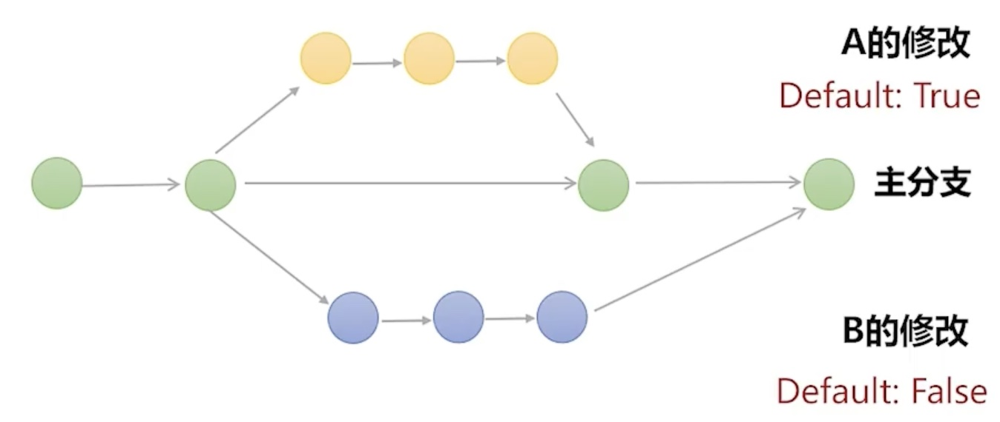
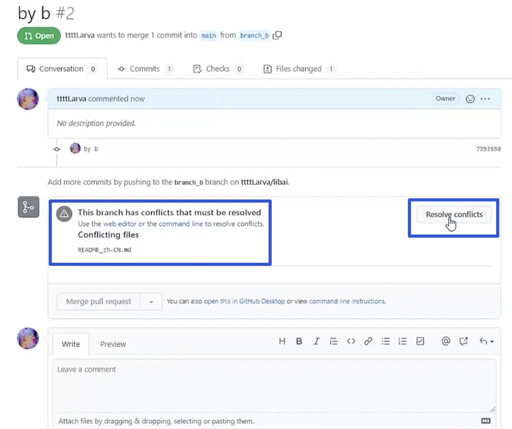
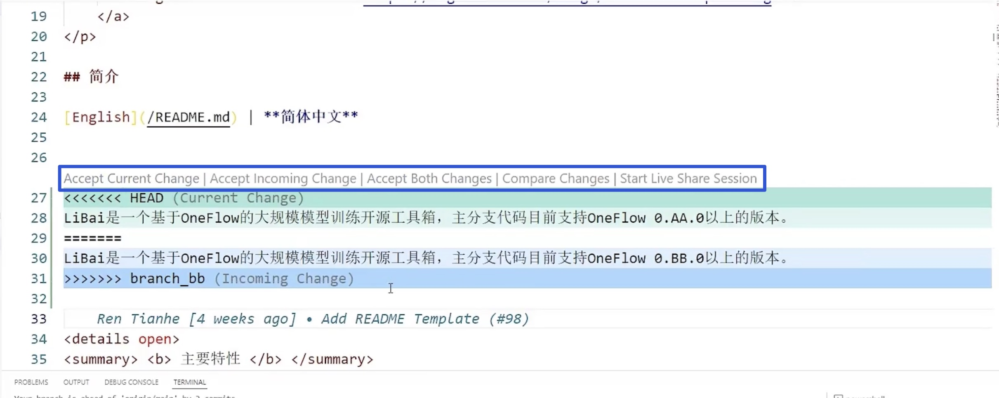

# 解决 Git 冲突：Merge Conflicts


:earth_asia: **Bilibili视频传送门：** [解决 Git 冲突：Merge Conflicts](https://www.bilibili.com/video/BV1aF411s7Ti?spm_id_from=333.999.0.0) :earth_asia:


这篇文章是 GitHub 专题，参与过开源项目的同学或早或晚都会遇到 Git 冲突的问题。

本篇文章想让大家知其然知其所以然，结构如下：

- 冲突是如何形成的
- 如何解决冲突
- 在 GitHub 上解决冲突
- 使用 VSCode 解决冲突


## 冲突是如何形成的

在使用 GitHub 参与开源项目时，可能会遇到多个 commit 修改的代码都是同一处的情况。

举个例子， A 同学和 B 同学都基于主分支进行修改。A 同学将某行代码写成了 Default True。但是 B 同学将某行代码写成了 Default False，然后先后合并入了主分支。



此时 Git 检测到这两个同学都对这同一行代码进行了修改。但是 Git 却没有能力去判断哪一个修正是正确的，哪一个修改是更好的。

这样的冲突，机器是没有办法通过自动化解决的，它需要人为地通过逻辑判断才能解决。于是 Git 就会报告产生了冲突，请求 B 同学去解决冲突。

那冲突到底长什么样呢？接下来，本篇文章就将模拟 A 和 B 同学，用命令行演示一下冲突的形成过程。

### 实践：冲突是如何产生的

接下来，以开源项目 OneFlow 中的 libai 仓库中的文档作为例子来演示。模拟 A 和 B 同学都对 libai 仓库中的 README 文件进行修改。

首先，A 同学基于 main 分支建立了一个 branch_a 的分支，`git checkout -b branch_a`。他在 branch_a 上做了修改，比如他认为文档中提及的版本应该是 0.A.0，修改保存，并且他做了修改之后，进行了提交，`git commit -a -m “by a”`。

接着来模拟 B 同学的操作，先切换到主分支，`git checkout main`。B 同学他也是类似的，基于 main 分支也创立了一个 branch_b 的分支，`git checkout -b branch_b`。但是 B 同学就和 A 同学的意见冲突了，他认为这个版本应该是 0.B.0，于是他做了相应的修改。接着，B 同学对这一笔修改进行了提交 commit，`git commit -a -m “by b”`。

完成后，切换回主分支。接着，主分支想要合并新功能。所以，我们首先合并 a 分支，`git merge branch_a`, 然后就合并成功了。接着，类似地合并 b 分支，`git merge branch_b`。可以发现这里会报冲突，这是由于 A 和 B 修改了相同的地方，所以 Git 检测到了，并且提示了要先去解决冲突后，再来提交。


## 如何解决冲突

冲突产生了，那么就必须通过人为解决才能合并入分支。实际上，Git 检测和标记冲突的方式是非常朴素且直接的，其实就是纯文本格式。

用 notepad++ 打开刚刚修改过的 README 文件。可以发现 Git 检测出了发生冲突的地方，并且用大于，等于，小于符号作为分隔符都标记了出来，这一切它都是一种纯文本的格式。

```Text
<<<<<<< HEAD
LiBai 是一个基于 Oneflow 的大型规模模型训练开源工具箱，主分支代码目前支持 OneFlow 0.A.0 以上的版本。
=======
LiBai 是一个基于 Oneflow 的大型规模模型训练开源工具箱，主分支代码目前支持 OneFlow 0.B.0 以上的版本。
>>>>>>> branch_b
```

大多数情况下，可能都是需要对这两个内容进行一个二选一的操作，即保留必要的内容，删除不必要的内容，还包括这里的标记符号。假设要保留 A 的修改，那就需要删掉 B 的内容和删掉分隔符。

```Text
LiBai 是一个基于 Oneflow 的大型规模模型训练开源工具箱，主分支代码目前支持 OneFlow 0.A.0 以上的版本。
```

保存后，再查看一下状态，`git status`。接着，将刚刚的改动进行一个提交，`git add .`。

可以看到，它自动生成了 commit 的信息。

输入 `git commit` 就可以提交成功了。

可以输入 `git log` 查看一下，可以看到 branch_a 和 branch_b 都已经合并到了 main 分支，还有一个用于解决冲突的 commit。

到目前为止，我们已经通过最本质的方式在本地制造了冲突，又解决了它。然而在更多情况下，作为开源贡献者，大家都是在远程协作的情况下产生的冲突。

而 GitHub，大家可以理解为网页版的 Git 前端，它有一些很方便的设计来帮助解决冲突。

## 在 GitHub 上解决冲突

这里用小糖 fork 的 OneFlow 的 libai 仓库作为例子，依旧是和前面一样的例子。不过现在需要将 branch_a 和 branch_b 这两个分支给推送到远程仓库，并且创建 PR。接着，创建一个 PR 到自己的仓库后，然后点击 merge。

接着，我们也对 b 分支进行一个创建 PR。可以看到这里 GitHub 已经检测出了在 README 这个文件中产生了冲突必须要解决。

这个时候需要点击 Resolve Conflicts 来解决。



然后可以发现 GitHub 的界面有一点点像网页版的编辑器，可以和刚刚本地的操作类似，去掉不重要，不必要的内容和分隔符。完成后，我们要点击右上角的 **Mark as resolved** ，接着点击 **Commit merge**。然后，就可以点到 **Merge pull request** 了。这样 branch_b 的 PR 也成功的被合并了。

回过头看看，可以看到有两笔 commit。第一笔，是我们本地的修改的 b 版本，第二笔，就是解决冲突时产生的 commit。

GitHub 可以使得在网页上就能解决冲突，但是对于一些比较复杂的冲突，GitHub 网页端也是无能为力，此时就需要像视频开始那样通过命令行 + 编辑器的方式来解决冲突。

刚刚用的编辑器是 Notepad++，但是这里推荐使用 VSCode 作为编辑器。VSCode 针对 Git 做了一些功能优化，这样能够大大提升我们解决冲突的效率

## 使用 VSCode 解决冲突

接下来看看，VSCode 面对冲突时是什么样子，可以发现 VSCode 非常体贴，它以彩色的方式来呈现了冲突，A 的修改是绿色的，B 的修改是蓝色的。



此外，VSCode 还提供了一些按键使得我们的操作更简便。

比如想保留 a 分支的内容，就应该删除 b 分支的内容和分隔符。在 VSCode 中就非常方便了，只用点击 **Accept Current Change** 这个按钮，就可以发现不需要的东西都被删除了。

并且，由于这些操作其实都是纯文本的操作，是可以撤销的，点击 Edit 中的 **Undo** 就可以还原。

**Accept Incoming Change** 是保留 b 分支的内容。
**Accept Both Changes** 是两个分支都保留。

剩下的有兴趣的话，都可以自己去试一试，总之来说就是非常的方便。