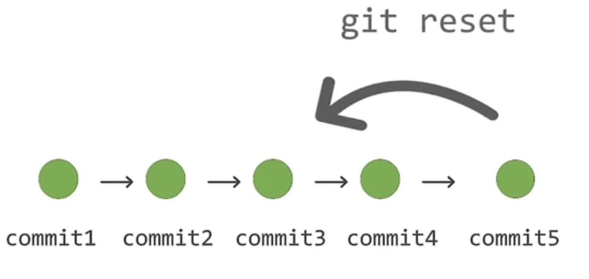
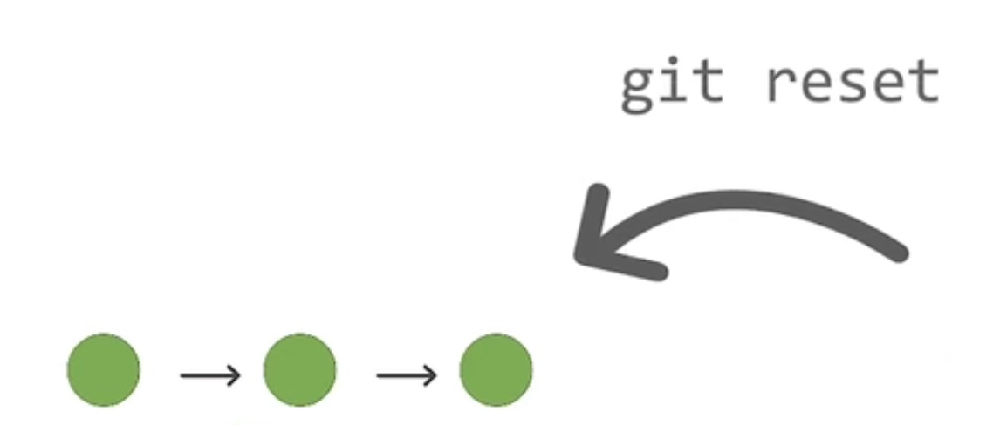
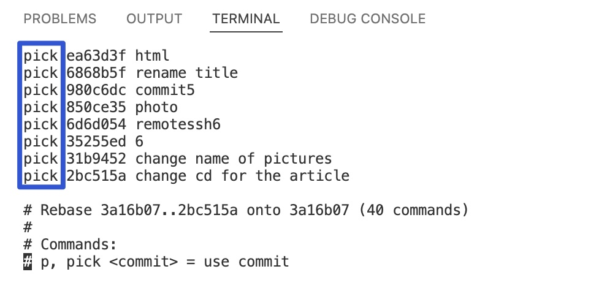
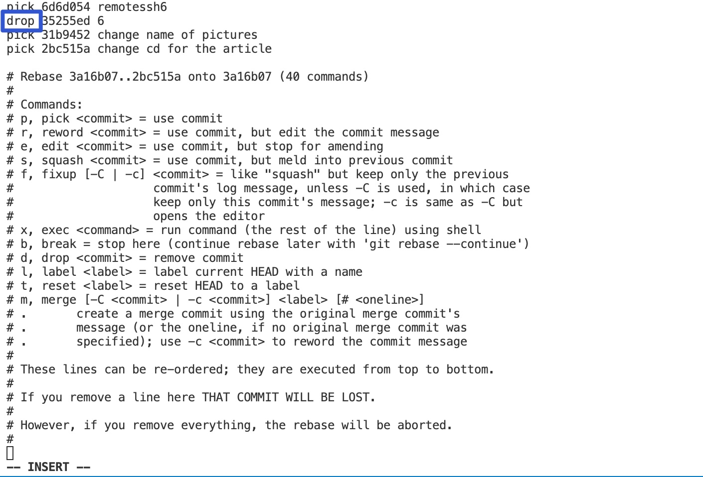

# 删除指定 commit 小妙招：git rebase

:earth_asia: **Bilibili视频传送门：** [删除指定 commit 小妙招：git rebase](https://www.bilibili.com/video/BV1Ka411b7jt?spm_id_from=333.999.0.0) :earth_asia:

本篇文章将介绍 git 的 rebase 命令，它可以帮助删除某条指定的 commit。

有时候，可能在一个分支中提交了多笔 commit，但是事后又想要删除某些 commit 应该怎么办？ 

这时候，有些同学就会说使用 git reset 命令就好，但是这其实是不行的。

git reset 命令它的作用是回滚到某个 commit，在这个 commit 之后的所有 commit 都会被删除。

正因如此，才需要介绍 git rebase 命令。

## 什么情况需要删除指定 commit

什么样的场景才会删除指定的 commit?

以 OneFlow 的 [flowvision 仓库](https://GitHub.com/Oneflow-Inc/vision)作为例子。

假定修改 flowvision 的 README 文件，一共有三个 feature，需要提交三次 commit。

首先，第一个 commit 修改了版本，把 `pip install flowvision==0.1.0` 改成了 `pip install flowvision==0.A.0`，保存后，进行提交。

第二个修改，修改了模型，把 `<li>AlexNet</li>` 修改成 `<li>TangNet</li>`，保存，进行提交。

第三个 commit，修改了示例代码，将 `model = alexnet()` 修改成 `model = TangNet()`，保存，进行提交。 

接着，用 `git log` 查看一下，可以发现这三个 commit 都已经提交了。

那么现在问题就来了，如果后来发现第二个 commit 的修改是不合适的，想要单独删除第二个 commit，同时保留另外两个，第一个和第三个 commit 应该怎么办？

这个时候就需要用到 **git rebase** 命令了。

## 使用 git rebase 删除指定 commit

git 的 rebase 命令顾名思义就是需要重新去选择一个 commit 作为 base，然后重新决定这个 base 之后的 commit 要怎么处理。

所以，敲重点来了，它的使用其实是分成两步走的：

第一步：是选择一个 commit 作为新的 base
  
第二步：是决定这个 base 之后每个 commit 该如何处理

接下来，就实际操作一下。

首先先用 `git log` 查看一下，找到那三笔 commit 之前的 commit，将它作为 base，这样子在它之后的 commit 就需要重新决定如何处理。

然后，运行 `git rebase -i commit_hash`， 后面接上我们刚刚选择的 base 的 hash 值。

例子：`git rebase -i f9d69755dd876dea481ece7775413d879bcf65a7`

这个时候跳转到了一个文本页面，它显示了刚刚做的三个修改的 commit。

找到第二个修改，把 **pick** 改成 **drop** ，然后保存，退出，就操作成功了。

接着再 `git log` 查看一下， 可以发现第二笔 commit 确实神奇地被删除了。

其实 rebase 的功能有很多，除了像刚刚看到的 pick、drop， 还有像 squash、reset 等用处。

感兴趣的同学可以参考一下 [git 的帮助文档](https://docs.github.com/en/get-started/using-git/about-git-rebase)。
