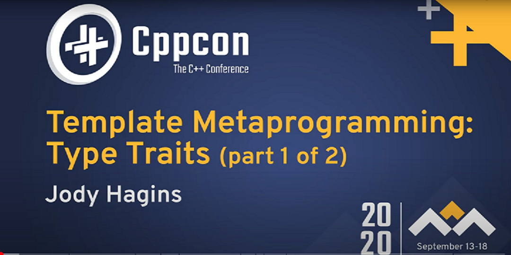
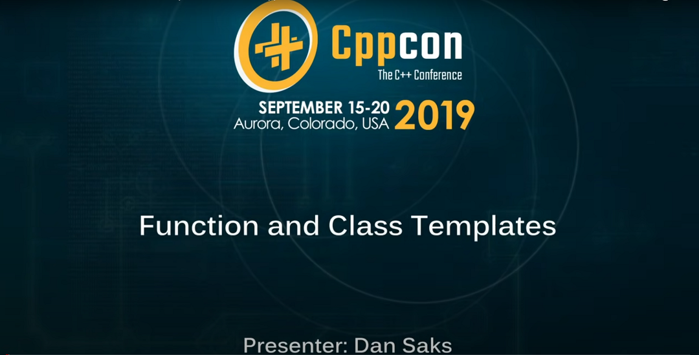
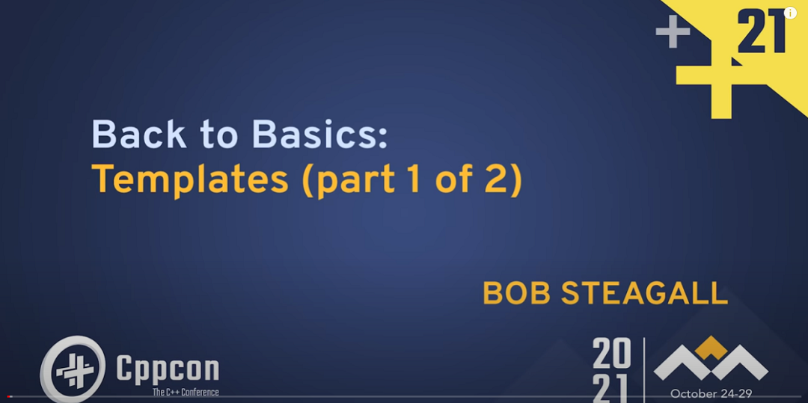
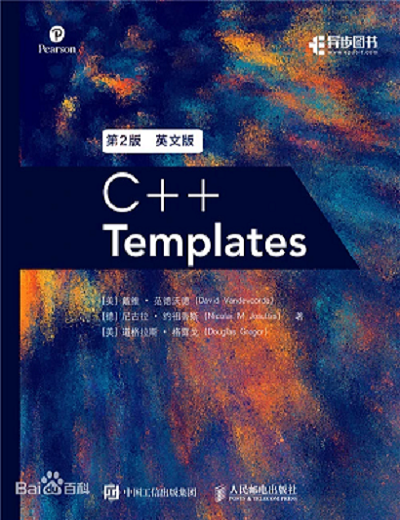
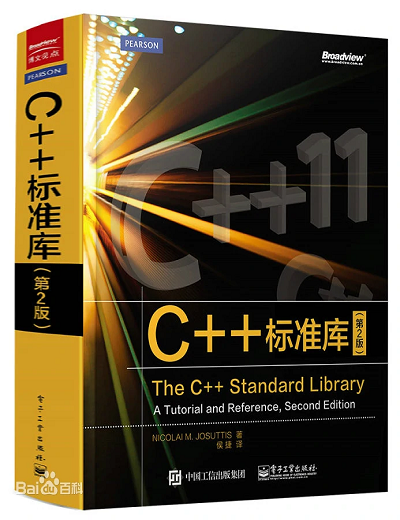

#模板元编程推荐资料

:earth_asia: **Bilibili视频传送门：** [C++新标准014_模板元编程资料](https://www.bilibili.com/video/BV1Lg41197MN?spm_id_from=333.999.0.0&vd_source=c64a1b3ef62311672865e1655c1eddeb) :earth_asia:

为了更好地入门或提升模板元编程能力，我们整理了3个视频，2本书籍，共五个资料推荐给大家。

##1. **视频传送门：** [CPPCON 2020: Template MetaProgramming](https://www.youtube.com/watch?v=tiAVWcjIF6o) 

第一个推荐的就是 CPPCON 2020 中的视频，标题叫做 Template MetaProgramming：Type Traits，这个视频高屋建瓴地谈到了模板元编程的要素，
并且和普通编程就参数、返回值等做了对比。

该视频还介绍了模板元编程中的约定、规范，然后选择了常用典型的 type traits 做了分析，期间还谈到了各种具体又有深度的概念，比如 void constant
、 SFINA 等等。

并且这个视频做了一个很好的分流：

    if 你看完这个视频觉得非常受用:

        说明你对模板元编程的概念已经掌握的不错了，下一步可以实战操练，比如看看 One Flow 源码;

    else if 你看完视频还是很懵:
    
        那么你需要增强一下基础知识，继续看下面的两个视频;

CPP Conference 有一个 Back to Basics 专题，由一些技术大牛讲解一些看似常见普通但却非常重要的概念，
推荐对模板编程不熟悉的同学看以下两个视频。

##2. **视频传送门：** [CPPCON 2019: Function and Class Templates](https://www.youtube.com/watch?v=LMP_sxOaz6g)

第二个推荐的是 CPPCON 2019 中的视频，标题叫做 Function and Class Templates。

##3. **视频传送门：** [CPPCON 2021: Back to Basics: Templates](https://www.youtube.com/watch?v=XN319NYEOcE)

第三个推荐的是 CPPCON 2021 中的视频，标题叫做 Back to Basice: Templates。

##4. **书籍：** C++  Templates

这本书几乎涵盖了 C++ 模板相关的所有重要话题，分为三个层次：

- basics
- depth
- design

如果说只能选择一本 C++ 模板相关的书籍，小糖一定只选它。

##5. **书籍:** C++ 标准库

这本书除了可以作工具书之外，还会介绍一些周边概念、内部原理及常见的坑，对我们理解 STL 和模板编程都非常有用，
不过本书的内容大部分都集中在 C++ 11，还没有引入更新的标准。

## 扩展阅读：One Flow 源码

- [Oneflow-Github](https://github.com/Oneflow-Inc/oneflow)

- [Oneflow-Index](https://docs.oneflow.org/master/index.html)