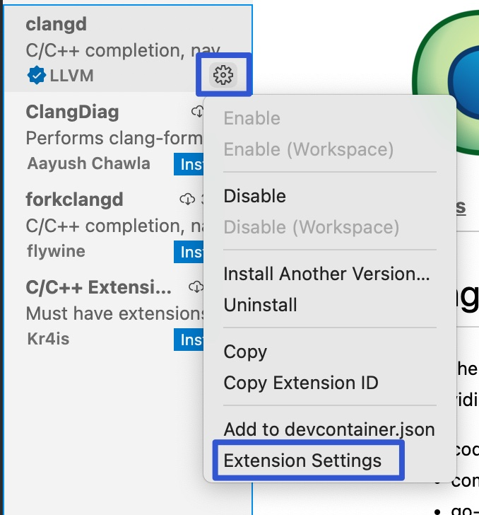
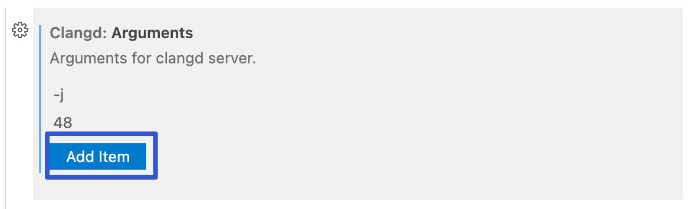

# Linux 下打造 C++ 完美开发 IDE：clangd

:earth_asia: **Bilibili视频传送门：** [远程开发C++_004_clangd](https://www.bilibili.com/video/BV16g411N77i?spm_id_from=333.999.0.0) :earth_asia:

一般在 Windows 上做 C++ 开发时，首选的 IDE 是 Visual Studio。Visual Studio 号称宇宙第一 IDE，也确实非常地好用，它的调试和符号跳转窗口都为开发 C++ 提供了非常大的便捷。

## Linux 上如何做 C++ 开发

但是如果需要在 Linux 上做 C++ 开发，该怎么办呢？

去搜索解决方案的话，可能会搜索到，通过配置 VIM 和 EMACS 来达到和 IDE 一样的效果。但是 VIM 这样的编译器，它的使用门槛是比较高的，是不适合刚刚从 Windows 转过来的 Linux 小白程序员。

但好消息是托 LLVM 和 VSCode 的福，只要拥有了 VSCode，再配合 clangd 插件，就可以使 VSCode 拥有和 IDE 一样的体验。

VSCode 的 clangd 插件是依赖于 clangd server 程序的，clangd server 是 LLVM 系列产品里的一个，之前说的 clangd-format 也是， 它可以帮助分析 C++ 文件，可以在 GitHub 上进行下载 [clangd server](https://github.com/clangd/clangd/releases)。

当下载完成 clangd 之后，将其解压，然后直接运行里面 bin 文件的 clangd，输入 `./bin/clangd`。如果运行成功，那么就说明我们也安装成功了。

## 配置 clangd 插件

安装成功 clangd server 之后呢，需要配置 VSCode。

### 安装 clangd 插件

**补充** ：如果安装了 clangd，那么就不要使用微软的 C++ 库了，需要 disable 掉，不然 clangd 是使用不成功的。

### 两处配置

接着需要对这个插件进行一些配置：

点击设置按钮，点击 Extension Settings。

第一个是 clangd server，也就是我们刚刚下载的那个 clangd server 的路径。

首先切换到 Linux 下的远程服务器的配置页面。

然后配置的是 clangd 的 path，也就是 server 的 path 配置。

例子：`/home/ttlarva/clangd/clangd_13.0.0/bin/clangd`

第二个配置是给 clangd server 增加一些运行时选项。

比如说可以增加 -j，后面接上 48。这个选项的意思就是希望 clangd 以 48 个线程来解析当前的工程，能更快、更高效地运作。

以上就对一个项目的 clangd 插件做好配置了。

### clangd 具体使用

clangd 为了能够更好地解析 C++ 文件，需要用户提供每个文件的编译选项，当然这不需要再手工做了，可以在 CMake 时加上 `-DCMAKE_EXPORT_COMPILE_COMMANDS=1` 的选项。

以上篇 [cmake_example](../remote_cpp_development/CMake.md) 为准, 来演示一下 clangd 的使用。

创建 build 目录，依次输入 `mkdir build`，`ls`，`cd build/`，`cmake .. -DCMAKE_EXPORT_COMPILE_COMMANDS=1` 后，就编译完成了。

在 CMake 构建完成之后呢，就可以发现在 build 目录下多了一个 json 文件。这个 json 文件指明了项目中每个文件的一个编译方式。

那也是因为这个 compile_commands.json 文件, 它可以使 clangd 更好地帮助进行一些符号跳转、查找、调试之类的功能。

当执行完以上操作以后，就可以来体会一下把 VSCode 当成 IDE 的感觉了。

## clangd 插件的使用

首先，当把鼠标停在某个函数，然后点击右键，会发现它多出了非常熟悉的选项。

接着来试一下符号跳转，按住 Control，然后鼠标左键，就可以对函数进行跳转。

它也可以对文件进行跳转，使用 **Control+P** ，打开标识符搜索框。

原来这个标识符搜索框是只可以搜索文件的，但现在可以搜索符号了，使用 **@** ，是在当前文件夹下搜索一个标识符。

这里比较少，就只有 main，可以多加两个函数：`int fun1(){}` 和 `Void fun2(){}`。再试试，就会发现它这里就有了三个标识符。

除了能在当前文件中搜索外，还可以使用 **#** 来在全局搜索：Control+P，输入 #print 可以搜索 print，选择后，可以来到 studio 这个文件下。
