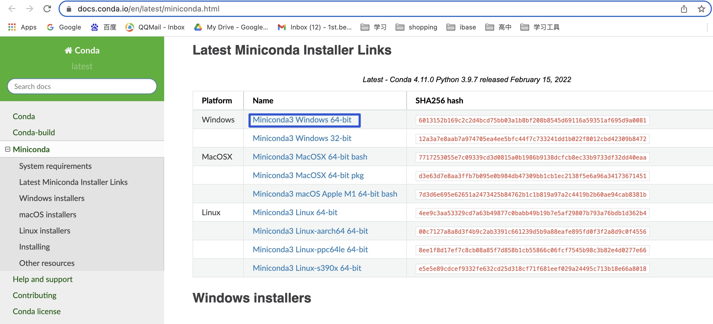
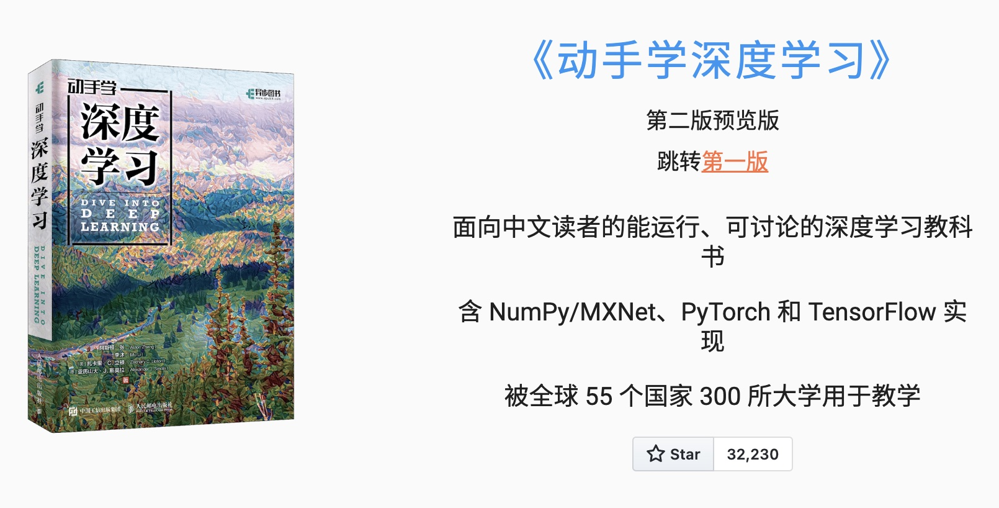

# Conda

:earth_asia: **Bilibili视频传送门：** [远程开发 C++ 002_Conda](https://www.bilibili.com/video/BV1Nq4y137Vh?spm_id_from=333.999.0.0) :earth_asia:

不知道大家有没有这样的经验，想要快速上手一个项目的时候，却发现搭环境都要耗个十天半个月的，不是动态库找不到，就是头文件找不到。再者，有的跑起来之后，却发现依赖的包版本又不对。

这个时候，**Conda** 就是非常有必要向大家推荐一款环境管理神器。

本文的结构如下：

- Conda 的基本使用
- 用 Conda 启动《动手学深度学习》这本书的学习环境

## Conda 的基本使用

首先，我们需要在这个[网站](https://docs.conda.io/en/latest/miniconda.html)下载对应的操作系统使用的 Miniconda 环境。

在 Windows 下，它是一个普通的软件包，双击就可以运行安装。

在 Linux 下，它是一个 Shell 的脚本，我们使用 `sh` 命令就可以运行这个脚本进行安装。

### Conda 进行环境隔离的好处

类似操作系统中多进程的思想，conda 的好处就是以环境为单位做包管理，这样我们可以创建多个互相不干扰的环境，也可以从别人预设好的环境，然后直接安装软件包。

## 创建 《动手学深度学习》 学习环境

学习深度学习的人，应该都听说过[《动手学深度学习》](https://zh.d2l.ai/)这本书，他是由大神李沐老师等人出品的，它不仅非常的权威全面，而且还是免费开源的。书中有非常多线性神经网络和深度学习计算的知识，还有 NLP 的相关知识。

如果你简单的认为这本书除了讲道理，就是附上了代码给我们看，那么就草率了。实际上，这本书叫做动手学的真正原因是因为它不仅附上了代码，而且代码还是可以直接运行的。

我们点击 Jupyter Notebook，就可以下载整个教程和代码了。

当我们安装完 Miniconda，也下载完这一本书之后。

需要按照这个[安装步骤](https://zh.d2l.ai/chapter_installation/index.html)进行安装。

使用 `~/miniconda3/bin/conda init` 命令，初始化一下conda。

然后使用 `conda create --name d2l python=3.8 -y` 为这本书创建一个新的环境。

在创建好新环境之后，我们就需要激活这个环境，使用 `conda activate d2l` 命令。

接着我们打开下载这本教程的目录，它有三个框架，目前我们使用 pytorch 框架。

如果还没有安装这个框架的话，那么可以使用这一条命令 `pip install torchvision==0.12.0` 安装。

然后需要安装 d2l 软件包，它封装了书中常用的函数和类，使用 `pip install d2l==0.17.5` 命令。

接下来，使用 Jupyter Notebook 打开这个教程。打开一个命令行，输入 `jupyter notebook`，按回车，我们就打开了这一个教程。

打开这本教程之后，就可以试试它是怎么动手的。

可以点到线性神经网络这一章，里面的 ipy 文件都是可以运行的。选择线性回归这一章节，是可以看到代码部分的。点击 **运行** ，就可以发现代码都是可以运行的。

比如，我们可以加上一行代码 `print(“hello world”)`，然后点击运行，就会发现运行成功，输出了 hello world。

本章节向大家展示了 Conda 是怎么下载和使用的，展示了如何动手搭建《动手学深度学习》这本书的学习环境。其实 Conda 的用处还不止于此，接下来的文章中将会向大家展示如何使用别人搭建好的 Conda 环境来编译一个大型的 C++ 工程。