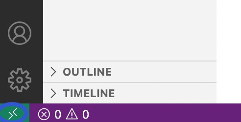
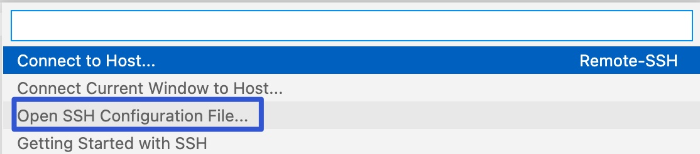
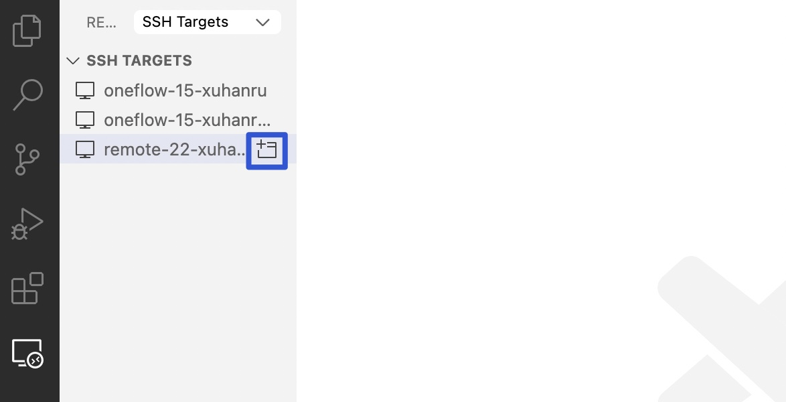
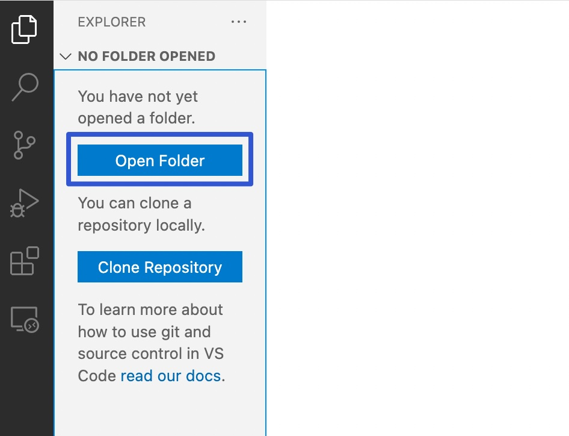

# VS Code插件 Remote SSH


:earth_asia: **Bilibili视频传送门：** [远程开发C++001_Remote SSH](https://www.bilibili.com/video/BV1YT4y1d78B?spm_id_from=333.999.0.0) :earth_asia:


在学习过如何使用 SSH 登录 GitHub 后 [GitHub SSH 免密码登录](learn_cpp/03_SSH_for_github.md)，我们对 SSH 已经有了基础的了解，比如像腾讯云和阿里云这样租用的服务器，我们都是可以通过 SSH 去登录。

远程开发 C++ 这一系列内容将向大家展示如何通过 SSH 登录一个服务器。

首先，这期主要向大家介绍一款非常好用的 VS Code 插件: **Remote SSH**，它可以让我们在远程服务器开发像在本地开发一样简单。

## 登录远程服务器
SSH 的使用较简单，如果已经在远程服务器上配置了密钥，那就可以直接通过 SSH 去登陆远程服务器：

在控制台输入 `ssh remote-21-ttlarva` （remote-21-ttlarva 需改成所需要使用的 Host 名）。

在登上远程服务器之后，我们就来到了 Linux 系统下，并且可以使用 Linux 命令，例如 `ls` 和 `man ssh`。不过只有一个命令行是不够方便的，如果我们不熟悉 Vim 这一类软件，并且喜欢用键盘加鼠标的组合，那么就需要 VS Code 的一个神奇插件了：Remote SSH。

Remote SSH 插件底层是通过 SSH 协议的，并且做了非常多贴心的开发和优化。这使得我们在安装好这个插件并配置好 SSH 登录选项后就可以直接打开远程服务器上的目录，就像在本地操作一样。更强大的是，VS Code 有了这个插件后，VS Code 的其他插件都可以直接安装在远程服务器上，换言之，这就让远程的开发更接近本地开发了。

## 安装 Remote SSH
安装较为简单，和其他插件安装方式相同：


安装完成之后，会发现左下角多了一个按钮：



点击它，然后选择 Open Configuration File：



打开我们配置文件，就是 `.ssh/config`

``` Text
Host oneflow-15-ttlarva-remote
	HostName 182.18.94.166
	Port 1615
	User ttlarva
	IdentityFile E:\oneflow_ssh\id_rsa

Host remote-21-ttlarva
	HostName 192.168.1.41
	Port 20021
	User ttlarva
	IdentityFile E:\oneflow_ssh\id_rsa
	ProxyCommand C:\Windows\System32\OpenSSH\ssh.exe -q -x -w %h:%p oneflow-15-ttlarva-remote
	StrictHostKeyChecking no
```
这里的 Host 名就是方便我们去记的名，而 HostName 就是 IP 地址，做完一系列配置之后，我们就可以去连接到远程服务器了。

当安装好这个插件之后，我们还会发现左边多了一个电脑一样的图标：


我们可以点击 Connect to Host in Current Window 在当前的窗口：



等到左下角不转圈时，就说明我们已经连接好了。我们打开一个终端试试，如果可以敲下 Linux 下的命令了，这就说明已经在远程服务器上了。

接着我们还可以使用 VS Code 去打开远程服务器上的文件夹目录，点击目录：Open Folder。



看到你需要的这个文件夹就是在远程服务器上的，打开它，点击 ok。这样我们就打开了一个远程服务器上的一个你需要的仓库。

## 在远程服务器上安装插件

在已经有 Remote SSH 能登录到远程服务器的基础上，我们可以在远程服务器上安装 VS Code 插件。

一开始打开一个 CMake 的文件，是没有高亮的，这是因为没有插件对它做语法解析。

如果我们现在想让他高亮起来，就需要安装插件：打开插件安装按钮，搜索 CMake。


看到 **Install in SSH:remote** 这个按钮，是提示我们可以安装在远程服务器上，点击它后，再回过来看我们的 CMake 文件，就已经高亮了。

当我们点击到插件安装栏，会发现它有帮我们展示出 Local 本地安装了哪些插件，远程服务器上安装了哪些插件，如果大家有发现在本地非常好用的插件，那么就可以安装到远程服务器上。点击 install in SSH:remote，就可以在远程服务器上使用了。

在我们给 VS Code 安装了 Remote SSH 插件后，我们可以让在远程服务器开发像在本地开发一样简单，也让远程服务器可以支持安装一系列的插件。